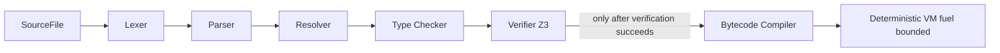

# Curlee


Curlee is an experimental **verification-first programming language** and C++23 compiler/runtime.

Curlee is a safety harness for AI-generated (and human-written) code: it refuses to run a program unless it can prove your declared contracts within a small, decidable verification scope.

---

## Why build Curlee?

Modern LLMs can generate a lot of code quickly - but a common failure mode is "almost correct" logic that compiles, runs, and silently does the wrong thing.

Curlee's goal is to be a **safety harness**:

- You write *intent* as machine-checkable contracts (`requires` / `ensures`) and refinements (`where`).
- The compiler uses an SMT solver (Z3) to prove obligations.
- If an obligation can't be proven (or the contract is outside the supported logic), Curlee **fails the build**.

This shifts trust from "I hope the generated code is safe" to "I have a proof (or the program doesn't run)".

---

## What problem does it solve?

### The core problem

AI-generated code is often:

- syntactically valid,
- type-correct,
- but logically wrong in edge cases.

Curlee introduces a new default:

> **No proof, no run.**

### The bigger picture: multi-agent sovereignty

Curlee aims to support a world where agents exchange tasks safely.

- An agent can send another agent a *bundle* (bytecode + metadata + declared capabilities).
- The receiver re-verifies the bundle deterministically before executing.
- Execution is capability-scoped (no ambient authority) and resource-bounded (fuel/gas).

---

## Key ideas (at a glance)

| Theme | Python/JS baseline | Curlee target |
| --- | --- | --- |
| Correctness | Tests + review + runtime errors | Compile-time contract proofs |
| Security | Ambient authority + sandboxing | Capabilities + proofs + fuel |
| AI-generated code | "Probably ok" | "Prove it or reject it" |
| Interop | Big ecosystems | "Shield" legacy ecosystems via explicit `unsafe` boundaries |

---

## Architecture

Curlee is structured as a compiler toolchain.



### Contracts and proof obligations

Example (intended syntax):

```curlee
fn divide(numerator: Int, denominator: Int) -> Int
  [ requires denominator != 0;
    ensures result * denominator == numerator; ]
{
  return numerator / denominator;
}
```

The compiler checks obligations like:

- At call sites: prove the callee's `requires` from the caller's facts.
- At returns: prove the function's `ensures`.

The MVP logic fragment is intentionally small and decidable.

---

## Project status

This repository is early-stage (alpha research prototype).

Expectations:

- The language and bytecode are not stable yet.
- Diagnostics, CLI output, and tests are expected to evolve.
- Verification is intentionally limited to a small fragment; out-of-scope contracts are rejected.
- If Curlee cannot prove a contract, it will not run the program.

### MVP scope (current)

Curlee currently supports two useful workflows:

- **MVP-check**: `curlee check <file.curlee>` runs lex -> parse -> resolve -> type-check -> verify (Z3). If a proof obligation can't be discharged (or is out of scope), Curlee fails with a diagnostic.
- **MVP-run**: `curlee run <file.curlee>` (or `curlee <file.curlee>`) runs `check` first, then executes a small verified subset on the deterministic VM (fuel-bounded).

The runnable subset is intentionally small:

- Expressions: `Int` / `Bool` literals, names, `+`, grouping.
- Statements: `let`, `return`, `if/else`, `while`.
- Calls: simple **no-arg** calls to a named function.

Out of scope (for now): strings, general unary/binary ops, function parameters, modules/import execution.

---

## Docs

User-facing documentation lives in the GitHub wiki:

- https://github.com/w4ffl35/curlee/wiki
- Supported fragment + stability: https://github.com/w4ffl35/curlee/wiki/Stability-and-Supported-Fragment

## Datasets

- `tests/correct_samples/` is the small, deterministic corpus of verified samples used by tests.
- `training_data.txt` is a **generated export** for downstream RAG/training workflows and is intentionally **gitignored**.
  - Regenerate via `python3 scripts/generate_correct_samples.py` (writes both `tests/correct_samples/` and `training_data.txt`).

---

## Build & run (Linux)

### Dependencies (Ubuntu/Debian)

```bash
sudo apt-get update
sudo apt-get install -y cmake ninja-build g++ libz3-dev pkg-config
```

By default, Curlee uses the system Z3 if available. To force the vendored build:

```bash
cmake --preset linux-debug -DCURLEE_USE_SYSTEM_Z3=OFF
```

### Configure

```bash
cmake --preset linux-debug
```

### Build

```bash
cmake --build --preset linux-debug
```

### Run

```bash
./build/linux-debug/curlee --help
./build/linux-debug/curlee check examples/mvp_run_int.curlee
./build/linux-debug/curlee run examples/mvp_run_control_flow.curlee
```

### Smoke test

For a quick end-to-end confidence loop (build + basic CLI + proof fixtures + a small targeted test run):

```bash
bash scripts/smoke.sh
```

You can also run both debug + release presets:

```bash
bash scripts/smoke.sh --both
```

### Coverage (unit tests)

To generate a coverage report from unit tests, Curlee provides a coverage preset + helper script.

Dependencies (Ubuntu/Debian):

```bash
sudo apt-get update
sudo apt-get install -y gcovr
```

Run:

```bash
bash scripts/coverage.sh
```

This will:

- Configure/build/test with the `linux-debug-coverage` preset.
- Generate an HTML report at `build/coverage/coverage.html`.
- Fail the run if line coverage is below the threshold (default: 100%).

Note: the gcovr report excludes `throw` and unreachable branches by default (so branch coverage isn't dominated by exception edges). You can opt back in with:

```bash
bash scripts/coverage.sh --include-throw-branches
bash scripts/coverage.sh --include-unreachable-branches
```

Adjust threshold or disable failing:

```bash
bash scripts/coverage.sh --fail-under 95
bash scripts/coverage.sh --no-fail
```

---

## Quick start examples

### 1) Small program that runs

Create `hello.curlee`:

```curlee
fn main() -> Int {
  return 1 + 2;
}
```

Then:

```bash
./build/linux-debug/curlee check hello.curlee
./build/linux-debug/curlee hello.curlee
```

### 2) Contracts that fail (expected)

These fixtures are in the repo and should produce a diagnostic:

```bash
./build/linux-debug/curlee check tests/fixtures/check_requires_divide.curlee
./build/linux-debug/curlee check tests/fixtures/check_ensures_fail.curlee
```

`curlee run` is verification-gated, so this should fail with the same diagnostic:

```bash
./build/linux-debug/curlee run tests/fixtures/check_ensures_fail.curlee
```

---

## License

MIT. See LICENSE.

---

## Contributing / development rules

- Curlee is verification-first: unsupported constructs must produce clear errors (no guessing).
- Keep changes small and test-driven.
- Prefer golden tests for diagnostics and verification failures.

### GitHub CLI: `gh pr edit` workaround

In this repo, `gh pr edit` may fail due to a GraphQL error involving deprecated classic project cards.

Workaround: patch the PR body via the REST API using:

```bash
scripts/gh_pr_patch_body.sh <pr-number> <body-file>
```

For agent guidance, see [.github/copilot-instructions.md](.github/copilot-instructions.md).
