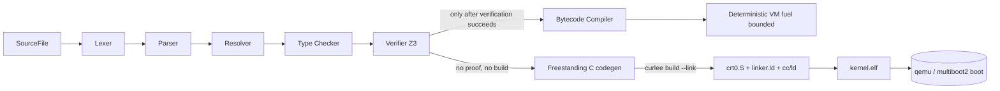

# Curlee


> **⚠️ PRE-ALPHA / RESEARCH SOFTWARE — NOT FOR PRODUCTION USE.**
>
> Curlee is an experimental language in "production-readiness stabilization". The supported
> language fragment is small and documented in the wiki; `python_ffi` interop is stubbed; the
> toolchain is Linux-only; and the verification pipeline is validated only against the
> project's own test corpus. Expect breaking changes, missing features, and rough edges.
> Contributions and experiments are welcome — production dependency is not.

Curlee is an experimental **verification-first programming language** and C++23 compiler/runtime.

Curlee is a safety harness for AI-generated (and human-written) code: it refuses to run a program unless it can prove your declared contracts within a small, decidable verification scope.

---

## Why build Curlee?

Modern LLMs can generate a lot of code quickly - but a common failure mode is "almost correct" logic that compiles, runs, and silently does the wrong thing.

Curlee's goal is to be a **safety harness**:

- You write *intent* as machine-checkable contracts (`requires` / `ensures`) and refinements (`where`).
- The compiler uses an SMT solver (Z3) to prove obligations.
- If an obligation can't be proven (or the contract is outside the supported logic), Curlee **fails the build**.

This shifts trust from "I hope the generated code is safe" to "I have a proof (or the program doesn't run)".

---

## What problem does it solve?

### The core problem

AI-generated code is often:

- syntactically valid,
- type-correct,
- but logically wrong in edge cases.

Curlee introduces a new default:

> **No proof, no run.**

### The bigger picture: multi-agent sovereignty

Curlee aims to support a world where agents exchange tasks safely.

- An agent can send another agent a *bundle* (bytecode + metadata + declared capabilities).
- The receiver re-verifies the bundle deterministically before executing.
- Execution is capability-scoped (no ambient authority) and resource-bounded (fuel/gas).

---

## Key ideas (at a glance)

| Theme | Python/JS baseline | Curlee target |
| --- | --- | --- |
| Correctness | Tests + review + runtime errors | Compile-time contract proofs |
| Security | Ambient authority + sandboxing | Capabilities + proofs + fuel |
| AI-generated code | "Probably ok" | "Prove it or reject it" |
| Interop | Big ecosystems | "Shield" legacy ecosystems via explicit `unsafe` boundaries *(planned; `python_ffi` is currently stubbed)* |

---

## Architecture

Curlee is structured as a compiler toolchain.


```mermaid
flowchart LR
  S[SourceFile] --> L[Lexer]
  L --> P[Parser]
  P --> R[Resolver]
  R --> T[Type Checker]
  T --> V[Verifier Z3]
  V -->|only after verification succeeds| C[Bytecode Compiler]
  C --> M[Deterministic VM fuel bounded]
  V -->|no proof, no build| F[Freestanding C codegen]
  F -->|curlee build --link| K[crt0.S + linker.ld + cc/ld]
  K --> E[kernel.elf]
  E --> Q[(qemu / multiboot2 boot)]
```

### Contracts and proof obligations

Example (intended syntax):

```curlee
fn add(a: Int, b: Int) -> Int
  [ requires a > 0;
    requires b > 0;
    ensures result > a && result > b; ]
{
  return a + b;
}
```

The compiler checks obligations like:

- At call sites: prove the callee's `requires` from the caller's facts.
- At returns: prove the function's `ensures`.

The MVP logic fragment is intentionally small and decidable.

---

## Project status

Curlee is in **production-readiness stabilization**.

Current expectations:

- The language and bytecode are not stable yet.
- Diagnostics, CLI output, and tests are expected to evolve.
- Verification is intentionally limited to a small fragment; out-of-scope contracts are rejected.
- If Curlee cannot prove a contract, it will not run the program.

### Production support policy (v1 target)

The production support matrix and exit-alpha criteria are tracked in the wiki:

- https://github.com/w4ffl35/curlee/wiki/Release-Checklist-and-Versioning

Canonical policy anchors:

- `Production support matrix`
- `Exit-alpha criteria`

### MVP scope (current)

Curlee currently supports two useful workflows:

- **MVP-check**: `curlee check <file.curlee>` runs lex -> parse -> resolve -> type-check -> verify (Z3). If a proof obligation can't be discharged (or is out of scope), Curlee fails with a diagnostic.
- **MVP-run**: `curlee run <file.curlee>` (or `curlee <file.curlee>`) runs `check` first, then executes a small verified subset on the deterministic VM (fuel-bounded).

The runnable subset is intentionally small:

The supported fragment evolves quickly; the **wiki is the source of truth**:

- Supported fragment + runnable subset: https://github.com/w4ffl35/curlee/wiki/Stability-and-Supported-Fragment
- Syntax reference: https://github.com/w4ffl35/curlee/wiki/Language-Syntax
- Modules/imports: https://github.com/w4ffl35/curlee/wiki/Modules-and-Imports
- Execution model (fuel, capabilities, interop): https://github.com/w4ffl35/curlee/wiki/Running-Programs

At a high level:

- `curlee check` supports imports (including aliasing and module-qualified calls) and function parameters, and verifies contracts within the MVP scope.
- `curlee run` executes a conservative, deterministic subset on the VM after successful verification (see the wiki for the exact runnable subset).

> **Python interop status:** `python_ffi` is currently **stubbed** — `python_ffi.call` is not yet implemented.
> It is gated behind `unsafe` and the `python.ffi` capability, but the call itself is a placeholder that
> currently accepts zero arguments. The "shield" boundary (Curlee validates contracts, Python executes
> legacy work) is planned, not yet available.

### Freestanding targets (kernel)

Curlee can also emit a verified program as **freestanding C** and, with `--link`, link it into a
bootable **x86-64 multiboot2 kernel ELF**:

- `curlee build <entry.curlee>` — verify, then emit freestanding C (default `out.c`).
- `curlee build --link -o kernel.elf <entry.curlee>` — emit C, compile it with
  `gcc -ffreestanding -fno-builtin -nostdlib -c`, assemble `runtime/crt0.S`, and link with
  `runtime/linker.ld` into `kernel.elf`.
- The **verification gate applies**: no proof, no build (nothing is emitted on failure).
- The freestanding target is **Linux/x86-64 only** and has **no hosted builtins** (no `print`,
  no `String`, no `Vec`). Physical memory access uses `Phys<T>` + `read()`/`write()` under
  `unsafe` and requires the `phys.mem` capability. The x86 **port I/O** builtins
  (`port_inb`/`port_outb`/`port_inw`/`port_outw`/`port_inl`/`port_outl`) accept either a
  **constant port** or a **`let`-bound base + constant offset** (issue #276, the virtio_net.c
  pattern) and are gated the same way; constant ports codegen with an 8-bit immediate where
  possible, runtime ports through the DX register, both as inline `in`/`out` assembly.
- Unsigned fixed-width integers (`U8`/`U16`/`U32`) are **usable in expressions** (issue #274):
  a port/`Phys` read can be bit-tested, compared, and arithmetically widened. `U8`/`U16`/`U32`
  operands implicitly widen to `Int` in arithmetic (results are `Int`); comparisons accept them
  directly (with `Int` literals auto-adapting); bitwise operators accept an `Int` *literal* on
  the other side (which adapts to the unsigned width), or widen the unsigned operand to `Int`
  for a non-literal `Int`. Reads stay **opaque** to the verifier — a contract can never see
  through a port/MMIO read value.
- A `U64` can be **constructed from an `Int` or a literal** (issue #277): an `Int` value in a
  `let` initializer or struct-literal field widens to `U64` when it is value-preserving — a
  compile-time-known literal must satisfy `0 <= value < 2^32` (all joeos physical addresses
  are 32-bit; an out-of-range or negative literal is a hard error, never a silent truncation).
  `U64 == U64` comparisons are legal; `U64` arithmetic and mixed `U64`/`Int` comparisons
  remain out of scope.
- **Fixed-size mutable arrays** `[T; N]` with indexed read/write `q[i]` / `q[i] = v` (issue
  #278): a `let q: [T; N] = [v; N];` binding is a freestanding-local array (ring buffers /
  driver state — the `fb.c` `tool_queue` and `virtio_net.c` `rx_buf_state` patterns), where
  `T` is `Int`/`U8`/`U16`/`U32`/`U64`, `N` is a positive integer literal (decimal; hex is
  reserved for physical-address literals), and `[0; N]` codegens to a zero-filled C array
  (`{0}`), a non-zero repeat to an explicit brace list. Every element access carries a
  **verifier bounds obligation** — constant out-of-bounds (including negative) indices are
  rejected by the type checker, and symbolic indices must be provably in `0..N-1` (the
  loop-invariant machinery discharges this for bounded ring indices); the verifier models the
  array with Z3 `select`/`store`, so read-over-write coherence is exact. MVP scope: arrays are
  `let` bindings only — no struct fields/params/returns/ghost snapshots, no multi-dimensional
  indexing, and predicates cannot reference array elements. `curlee run` rejects arrays (they
  are freestanding-only).
- The VM never runs freestanding programs (`curlee run` rejects `Phys`/`extern`/port I/O
  bodies); `curlee build` is the freestanding execution path.

End-to-end hello-kernel walkthrough:

```bash
./build/linux-debug/curlee build --link -o kernel.elf tests/codegen/kernel_hello.curlee
qemu-system-x86_64 -kernel kernel.elf   # boots, prints 'Hi' via curlee_putc, halts
```

The kernel carries both a multiboot2 header (for GRUB and QEMU's `-kernel` loader) and a PVH
ELF note. QEMU's `-kernel` loader prefers the multiboot2 protocol and enters the image in
**32-bit protected mode**; `runtime/crt0.S` detects the entry mode (`EFER.LMA`) and, when
entered in 32-bit mode, sets up identity-mapped 2 MiB page tables and switches to 64-bit long
mode itself before calling `curlee_main`. The PVH note keeps the image bootable on loaders that
enter directly in long mode.

---

## Docs

In-repo documentation:

- [`docs/README.md`](docs/README.md) — index and pointers
- [`CONTRIBUTING.md`](CONTRIBUTING.md) — contributor guide
- [`SECURITY.md`](SECURITY.md) — how to report vulnerabilities

Detailed user-facing documentation (supported fragment, syntax, modules, execution model) lives in the GitHub wiki:

- https://github.com/w4ffl35/curlee/wiki
- Supported fragment + stability: https://github.com/w4ffl35/curlee/wiki/Stability-and-Supported-Fragment
- C++23 code quality standards: https://github.com/w4ffl35/curlee/wiki/C%2B%2B23-Code-Quality-Standards

## Datasets

- `tests/correct_samples/` is the small, deterministic corpus of verified samples used by tests.
- `training_data.txt` is a **generated export** for downstream RAG/training workflows and is intentionally **gitignored**.
  - Regenerate via `python3 scripts/generate_correct_samples.py` (writes both `tests/correct_samples/` and `training_data.txt`).

---

## Build & run (Linux)

### Dependencies (Ubuntu/Debian)

```bash
sudo apt-get update
sudo apt-get install -y cmake ninja-build g++ libz3-dev pkg-config
```

By default, Curlee uses the system Z3 if available. To force the vendored build:

```bash
cmake --preset linux-debug -DCURLEE_USE_SYSTEM_Z3=OFF
```

### Configure

```bash
cmake --preset linux-debug
```

### Build

```bash
cmake --build --preset linux-debug
```

### Run

```bash
./build/linux-debug/curlee --help
./build/linux-debug/curlee check examples/mvp_run_int.curlee
./build/linux-debug/curlee run examples/mvp_run_control_flow.curlee
```

### Smoke test

For a quick end-to-end confidence loop (build + basic CLI + proof fixtures + a small targeted test run):

```bash
bash scripts/smoke.sh
```

You can also run both debug + release presets:

```bash
bash scripts/smoke.sh --both
```

### Coverage (unit tests)

To generate a coverage report from unit tests, Curlee provides a coverage preset + helper script.

Dependencies (Ubuntu/Debian):

```bash
sudo apt-get update
sudo apt-get install -y gcovr
```

Run:

```bash
bash scripts/coverage.sh
```

This will:

- Configure/build/test with the `linux-debug-coverage` preset.
- Generate an HTML report at `build/coverage/coverage.html`.
- Fail the run if line coverage is below the threshold (default: 94%; the CI gate enforces 100%).

Note: the gcovr report excludes `throw` and unreachable branches by default (so branch coverage isn't dominated by exception edges). You can opt back in with:

```bash
bash scripts/coverage.sh --include-throw-branches
bash scripts/coverage.sh --include-unreachable-branches
```

Adjust threshold or disable failing:

```bash
bash scripts/coverage.sh --fail-under 95
bash scripts/coverage.sh --no-fail
```

---

## Quick start examples

### 1) Small program that runs

Create `hello.curlee`:

```curlee
fn main() -> Int {
  return 1 + 2;
}
```

Then:

```bash
./build/linux-debug/curlee check hello.curlee
./build/linux-debug/curlee hello.curlee
```

### 2) Contracts that fail (expected)

These fixtures are in the repo and should produce a diagnostic:

```bash
./build/linux-debug/curlee check tests/fixtures/check_requires_fail.curlee
./build/linux-debug/curlee check tests/fixtures/check_ensures_fail.curlee
```

`curlee run` is verification-gated, so this should fail with the same diagnostic:

```bash
./build/linux-debug/curlee run tests/fixtures/check_ensures_fail.curlee
```

---

## License

MIT. See LICENSE.

---

## Contributing / development rules

- Curlee is verification-first: unsupported constructs must produce clear errors (no guessing).
- Keep changes small and test-driven.
- Prefer golden tests for diagnostics and verification failures.

### GitHub CLI: `gh pr edit` workaround

In this repo, `gh pr edit` may fail due to a GraphQL error involving deprecated classic project cards.

Workaround: patch the PR body via the REST API using:

```bash
scripts/gh_pr_patch_body.sh <pr-number> <body-file>
```

For agent guidance, see [.github/copilot-instructions.md](.github/copilot-instructions.md).
