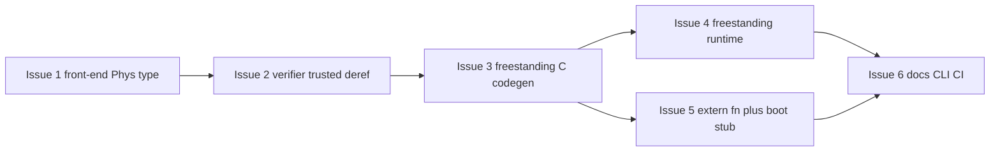

# Curlee: Freestanding Execution, Raw Pointer Contracts, External Linkage

Status: Confirmed plan
Scope: Audit findings + architecture + GitHub issue breakdown (6 issues)
Design decisions (confirmed with user): capability name `phys.mem`; boot acceptance target
x86-64 + qemu multiboot2.

## Issue index

| # | Issue file | GitHub issue | Title | Depends on |
|---|-----------|--------------|-------|-----------|
| 1 | [`plans/issues/01-frontend-phys-type.md`](plans/issues/01-frontend-phys-type.md) | [#252](https://github.com/w4ffl35/curlee/issues/252) | Front-end support for `Phys<T>`: type, `phys()` literal, gated `read`/`write` | — |
| 2 | [`plans/issues/02-verifier-phys-trusted-deref.md`](plans/issues/02-verifier-phys-trusted-deref.md) | [#253](https://github.com/w4ffl35/curlee/issues/253) | Verifier: trusted/opaque `Phys<T>` deref semantics | 1 |
| 3 | [`plans/issues/03-codegen-freestanding-c.md`](plans/issues/03-codegen-freestanding-c.md) | [#254](https://github.com/w4ffl35/curlee/issues/254) | Codegen backend: freestanding C emission + `curlee build --target freestanding-c` | 2 |
| 4 | [`plans/issues/04-freestanding-runtime.md`](plans/issues/04-freestanding-runtime.md) | [#255](https://github.com/w4ffl35/curlee/issues/255) | Freestanding runtime: `runtime/rt.c` (mem ops, halt, weak putc) | 3 |
| 5 | [`plans/issues/05-extern-fn-boot-stub-link.md`](plans/issues/05-extern-fn-boot-stub-link.md) | [#256](https://github.com/w4ffl35/curlee/issues/256) | `extern fn` + `crt0.S` boot stub + linker script + `curlee build --link` | 3 |
| 6 | [`plans/issues/06-cli-docs-ci.md`](plans/issues/06-cli-docs-ci.md) | [#257](https://github.com/w4ffl35/curlee/issues/257) | CLI/docs/CI integration for freestanding + `phys.mem` | 4, 5 |

---

## 1. Audit findings

### 1.1 Pipeline today (VM interpreter only)

```
Source -> Lexer -> Parser -> Resolver -> Type Check -> Verifier (Z3) -> Bytecode Emitter -> VM (interpreter)
```

- The compiler's only execution target is the tree-walking/interpreter VM. `emit_bytecode` produces a
  `curlee::vm::Chunk` ([`emitter.h`](include/curlee/compiler/emitter.h:22)) which the VM runs from
  [`src/vm/vm.cpp`](src/vm/vm.cpp:546). There is **no native codegen**, no `-nostdlib` path, no freestanding target.
- Entry point discovery is `main` in the emitter ([`Emitter::find_main`](src/compiler/emitter_impl.ipp:210));
  `main` is emitted at ip=0 for the VM.

### 1.2 The VM/runtime is deeply libc-dependent

- `Value` ([`value.h`](include/curlee/vm/value.h:48)) uses `std::string`, `std::shared_ptr`,
  `std::unordered_set`; the VM uses `<iostream>`, `<fstream>`, `fork`/`exec`/`poll`/`pipe` for
  python interop, `std::getenv`, `std::signal`, etc. (`[vm.cpp](src/vm/vm.cpp:1)`).
- Conclusion: porting the existing VM to freestanding is a huge, low-value effort. The right path is a
  **new native codegen backend that emits freestanding C** (compiler handles ABI; we control the runtime).

### 1.3 `unsafe` exists but means "capability gate", not "raw memory"

- `unsafe` blocks are parsed ([`ast.h`](include/curlee/parser/ast.h:243)), resolved, type-checked
  ([`type_check.cpp`](src/types/type_check.cpp:478) increments `unsafe_depth_`), verified
  ([`checker.cpp`](src/verification/checker.cpp:881) walks body), and emitted
  ([`emitter_impl.ipp`](src/compiler/emitter_impl.ipp:401)).
- Today `unsafe` only gates `python_ffi.call` style host calls. There is **no pointer type, no address
  literal, no load/store construct, no memory-safety concern** anywhere — the verifier never rejects an
  OOB access because no raw memory access exists to check.

### 1.4 No external linkage concept

- No `extern` declarations, no symbol model, no linker integration. Functions must have bodies.
- Capability flow already exists and is well-plumbed: `--cap` CLI flag, `Capabilities` set
  ([`capabilities.h`](include/curlee/runtime/capabilities.h:20)), `required_capabilities` checked at
  `run` time ([`cli_impl.ipp`](src/cli/cli_impl.ipp:1134)). A new `phys.mem` capability slots in naturally.

### 1.5 Verifier modeling scope

- Z3 lowering is int/bool only ([`checker_impl.ipp`](src/verification/checker_impl.ipp:169)); there is no
  pointer sort. Contracts on MMIO reads cannot be proved (values are opaque) — must be documented as
  **trusted/opaque** semantics.

### 1.6 Process constraints (from repo policy)

- Code changes are Issue-gated ([`.github/copilot-instructions.md`](.github/copilot-instructions.md:79));
  work happens on `develop`, lands via PRs.
- Wiki (`wiki/`, a separate gitignored repo) is the spec source of truth; any syntax/CLI/verification-scope
  change must update the wiki in the same work item.
- Issue bodies must include: motivation, MVP scope (in/out), acceptance criteria, verification plan, wiki refs.
- `gh issue edit` with code blocks must use `--body-file`.

---

## 2. Architecture decisions

### 2.1 Freestanding target = new `src/codegen/` module emitting freestanding C

- New CLI subcommand: `curlee build --target freestanding-c [-o out.c] entry.curlee`
- Full verification pipeline runs first (**no proof, no build** — same gate as `run`).
- Codegen walks the verified `Program` AST directly (like the emitter does), emitting structured C:
  - Int -> `int64_t`, Bool -> `_Bool`, new U8/U16/U32/U64 -> `uint8_t/16/32/64_t` (from `<stdint.h>`, a
    freestanding header — no libc needed).
  - `main` -> `int64_t curlee_main(void)`; non-extern fns -> `curlee_<name>`; extern fns -> 1:1 identifiers.
  - Phys load/store -> `*(volatile uintN_t*)(ADDR)` / assignment with the constant embedded.
- The existing bytecode emitter + VM are untouched; VM execution of pointer/unsigned programs is
  explicitly out of scope for the MVP (documented error if attempted).

### 2.2 Raw pointer contracts = new `Phys<T>` type + trusted deref

- Syntax (locked for consistency across issues):
  ```curlee
  let reg: Phys<U32> = phys<U32>(0x3F00_0000);  // address MUST be an integer literal
  let v: U32 = reg.read();                       // unsafe + cap phys.mem required
  reg.write(0x1);
  ```
- Rules enforced at type-check + verifier (defense in depth):
  - Address argument must be a compile-time integer literal (decimal or hex with `_` separators).
    Any computed expression -> hard error "physical address must be a constant literal".
  - `read`/`write` only inside `unsafe` blocks AND the enclosing function must take `cap phys.mem`.
- Verifier semantics: `Phys<T>` is an opaque value; `read`/`write` are uninterpreted Z3 functions with
  **no axioms** -> no OOB obligation is generated (documented, trusted access). Contracts cannot see
  through MMIO reads (values symbolic). This is the honest soundness posture: the *address* is
  constrained, the *access* is trusted, the *data* is opaque.

### 2.3 External linkage = `extern fn` + freestanding stub + linker script

- Syntax: `extern fn putc(c: Int) -> Unit;` (no body; optional requires/ensures are **assumed**, with a
  diagnostic note "extern boundary: contract assumed").
- Codegen emits `extern` declarations + direct calls; the symbol is resolved at link time.
- Bundled runtime:
  - `runtime/crt0.S` — x86-64 `_start`: zero BSS, set `rsp` to `__stack_top`, `call curlee_main`, then
    `cli; hlt` loop. Optional multiboot2 header for qemu `-kernel`.
  - `runtime/linker.ld` — `.text/.rodata/.data/.bss` + stack symbols + `ENTRY(_start)`.
  - `runtime/rt.c` — freestanding runtime: `memset`/`memcpy`/`memcmp` (compiler builtins), `curlee_halt`,
    `curlee_panic` (hlt loop), weak `curlee_putc` (host may override). No malloc.
- CLI: `curlee build --target freestanding-c --link [-o kernel.elf] entry.curlee` invokes
  `cc -ffreestanding -fno-builtin -nostdlib` + `ld -nostdlib -T runtime/linker.ld`.

### 2.4 Capability: `phys.mem`

- New capability string granted via existing `--cap phys.mem`; flows through
  `required_capabilities`/`Capabilities` machinery unchanged.

---

## 3. Issue breakdown (6 issues)



### Issue 1 — Front-end: `Phys<T>` type, `phys(addr)` literal, `read`/`write` (gated)

- Lexer: `KwPhys`. Parser/AST: `PhysExpr{elem, lexeme}`, `PhysReadExpr`, `PhysWriteExpr` nodes; `Function`
  unchanged. Type system: new primitives `U8/U16/U32/U64`; `TypeKind::Phys` with element kind.
- Type checker: constant-literal address validation; `read`/`write` require `unsafe_depth_ > 0` and an
  in-scope `cap phys.mem` parameter; result typing.
- Out of scope: VM opcodes for Phys (freestanding-only), arithmetic on Phys values, pointer arithmetic.
- Acceptance: fixtures parse+type-check (framebuffer write, PCIe register read); computed address and
  deref-outside-unsafe produce golden diagnostics; `check` passes.
- Verification: lexer/parser/type-check/resolver unit tests + golden diagnostics + fixtures.

### Issue 2 — Verifier: trusted `Phys<T>` deref semantics

- Z3: `Phys<T>` -> opaque sort; `phys_read`/`phys_write` uninterpreted with no axioms; address literal ->
  constant. No OOB obligation for trusted access. Non-literal address = hard error (defense in depth).
- Out of scope: reasoning about loaded values, bounds on MMIO regions.
- Acceptance: `check` succeeds on pointer fixtures; golden diagnostics for the non-literal error; existing
  suite stays green.
- Verification: `checker`/`predicate_lowering` unit tests, golden tests.

### Issue 3 — Codegen backend: freestanding C target

- New `include/curlee/codegen/codegen.h` + `src/codegen/codegen.cpp`:
  `codegen_freestanding_c(const Program&) -> variant<std::string, vector<Diagnostic>>`.
- Walk AST (reuse emitter patterns): structured if/while/return, `int64_t`/`_Bool`/`uintN_t` types,
  `curlee_`-prefixed internals, Phys -> volatile derefs with embedded constants, extern -> `extern` decls.
- Unsupported-on-freestanding builtins (`print`, `__tty_*`, fs, rng, vec, python) -> clear diagnostic.
- CLI: `curlee build --target freestanding-c` (runs full verify first; **no proof, no build**).
- Out of scope: link step (Issue 5), VM opcodes, optimization.
- Acceptance: golden C output tests for arithmetic/control-flow/calls/Phys/extern; emitted C compiles with
  `gcc -ffreestanding -fno-builtin -nostdlib -c`.
- Verification: `tests/codegen_tests.cpp` + fixtures + `.expected` goldens + a smoke target in CMake.

### Issue 4 — Freestanding runtime (`runtime/rt.c`)

- `memset`/`memcpy`/`memcmp` (compiler builtins), `curlee_halt`, `curlee_panic`, weak `curlee_putc`.
  Static allocation only; no malloc. Freestanding `stdint.h` only.
- Out of scope: heap allocator, printf, FP, threads.
- Acceptance: `rt.c` compiles freestanding; links with a hello-world kernel (via Issue 3 + 5 machinery or
  a raw C test) into an ELF; qemu boots it and the debug-exit/COM1 check passes (or at minimum objdump
  shows entry at `_start` with BSS zeroed).
- Verification: CMake custom target + a tiny test kernel + qemu smoke in CI.

### Issue 5 — `extern fn` declarations + boot stub + link step

- Lexer `KwExtern`; parser allows body-less `extern fn` (with optional contracts); resolver/type-check
  register extern fns; verifier treats them as trusted boundaries (assume requires/ensures + Note
  diagnostic); VM `run` rejects programs with extern fns (diagnostic); codegen emits `extern` + calls.
- `runtime/crt0.S` (x86-64 `_start`, BSS zero, stack setup, optional multiboot2), `runtime/linker.ld`,
  `curlee build --link` integration.
- Out of scope: other arches, shared libraries, extern globals.
- Acceptance: sample kernel with `extern fn putc` links with `-nostdlib`; `objdump -f` shows entry
  `_start`; boots under qemu reaching `curlee_main` (deterministic exit check).
- Verification: linker/objdump/qemu smoke target in CMake + CLI golden tests.

### Issue 6 — CLI, docs, wiki, CI

- `curlee build` help text + README; wiki updates: Language-Syntax (Phys/extern), Verification-Scope
  (trusted deref + opaque reads), Running-Programs (freestanding target + `phys.mem`), new CLI page.
- CI: `freestanding` job — build curlee, codegen a fixture, `gcc -ffreestanding -fno-builtin -nostdlib -c`,
  link smoke, qemu smoke.
- Out of scope: none (pure integration).
- Acceptance: `--help` shows `build`; wiki pages updated in `wiki/`; CI job green.
- Verification: `ctest`, golden CLI tests, CI run.

---

## 4. Dependency order for implementation

1. Issue 1 (front-end types) — blocks 2
2. Issue 2 (verifier) — blocks 3
3. Issue 3 (codegen C emission)
4. Issue 4 (runtime) + Issue 5 (extern/stub/link) — both depend on 3, independent of each other
5. Issue 6 (docs/CI) — last

## 5. Decisions (confirmed)

- Capability name: `phys.mem`.
- Issue split: 6 issues (freestanding split into codegen + runtime + extern/stub; pointers split into
  front-end + verifier; integration/CI last).
- Boot target for acceptance: x86-64 + qemu (multiboot2).

Filing: each issue body is in `plans/issues/` and will be created via
`gh issue create --body-file` (per repo policy, bodies with code blocks must use `--body-file`).
